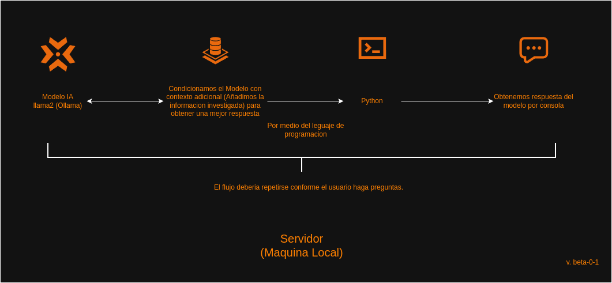

# chatbox-server
Este proyecto permite consultar información sobre enfermedades comunes en perros utilizando un modelo de lenguaje local (Ollama) y un índice de búsqueda rápido basado en embeddings de texto.

## Requisitos

- Python 3.x
- Pip (para instalar las dependencias)

## Instalación

1. Crea un entorno virtual (opcional, pero recomendado):

    ```bash
    python -m venv venv
    ```

2. Activa el entorno virtual:

    - En Windows:
    ```bash
    .\venv\Scripts\activate
    ```

    - En Linux/Mac:
    ```bash
    source venv/bin/activate
    ```

3. Instala las dependencias:
    - fastapi
    - uvicorn
    - requests
    - faiss-cpu
    - sentence-transformers
    - numpy
    ```bash
    pip install -r requirements.txt
    ```
    - Verifica tus dependencias con:
    ```bash
    pip list
    ```

4. Asegúrate de tener Ollama corriendo en tu máquina local.

5. Coloca tu archivo `context.json` con la información de las enfermedades en el mismo directorio que el script.

## Ejecución de prueba de servidor Ollama

Para ejecutar el archivo de prueba, corre el siguiente comando:

```bash
python3 app/test.py
```

## Ejecucion del servidor como REST-API
- Para pruebas locales usamos la dependencia de fast-api, ya que es bastante facil de utilizar, podemos ejecutar :
```bash
PYTHONPATH=app uvicorn main:app --reload
```
Tendras disponible una URL como esta con su metodo HTTP: , el cual deberia retornar un mensaje "El servicio esta funcionando!", si todo
fue bien.
```bash
GET http://localhost:8000/api/status
```

## Diagrama del servidor de la version beta-0-1.



## Información publica sobre la dependencia de Ollama:
1. Uso de :
```bash
ollama_url = 'http://localhost:11434/api/generate
```
Cuando instalas y corres Ollama en tu PC, Ollama levanta un servidor HTTP local (una API REST) automáticamente en: http://localhost:11434
Entonces, aunque el modelo está instalado en tu PC, la forma de pedirle respuestas es enviándole una petición HTTP POST a esa dirección.
Tú no cargas el modelo directamente desde Python como un archivo .bin, sino que le hablas a través de su servidor que ya está corriendo localmente.

## Flujo del codigo.
1. Cargar el JSON (context.json).

2 .Crear embeddings de cada enfermedad (concepto, síntomas, etc).

3 .Indexarlos con FAISS.

4. Al recibir una pregunta:
Embedding de la pregunta.
Buscar el más cercano en FAISS.
Usar ese pedazo como contexto al llamar a llama2.

## ¿Qué es un Embedding?
- En términos simples, un embedding es una representación numérica (vector) de algo que originalmente es texto o información no estructurada.

-Imagina que tienes un texto, como una frase o un párrafo. Para que un modelo de machine learning pueda entender ese texto, necesitas convertirlo en un formato numérico. Un vector es precisamente eso: una lista de números que representan la información contenida en ese texto.

Por ejemplo, una frase como "El perro está enfermo" se podría transformar en un vector como este (números aleatorios de ejemplo):
```bash
[0.25, -0.8, 1.2, 0.3, -0.1]
```
Este vector contiene toda la información de la frase, pero de manera numérica, lo que hace que el modelo pueda trabajar con él.

## Division del JSON para aplicar concepto Embedding!
Supongamos que su JSON tiene mucha información importante sobre enfermedades caninas. Pero para que un modelo pueda procesarlo correctamente, necesitamos representarlo de manera que el modelo entienda semánticamente cada enfermedad, sus síntomas, remedios, etc.
Aquí es donde entramos en el concepto de embeddings.

## ¿Por qué dividirlo en partes (vectores)?
a. Facilita la comprensión semántica:
Cada parte del JSON, como la descripción de una enfermedad o sus síntomas, puede ser procesada de manera separada. Al dividirla, puedes transformar cada uno de esos bloques de texto en vectores (embeddings). Esto tiene varias ventajas:

- Representación densa: Los vectores permiten representar información de manera más eficiente que las cadenas de texto.
- Captura semántica: Los embeddings permiten que el modelo entienda no solo las palabras, sino también el significado subyacente de esas palabras. Por ejemplo, "fiebre" y "calor" pueden estar cerca en el espacio vectorial, lo que ayuda al modelo a asociar conceptos similares.

b. Búsqueda eficiente:
- Cuando un usuario hace una pregunta sobre una enfermedad, es difícil buscar en todo el JSON sin un sistema que comprese la información. Si el JSON es muy grande, se convierte en un problema de rendimiento buscar entre todos los datos.

- La idea de FAISS y embeddings es buscar rápidamente qué parte de la información en tu JSON es la más relevante para la pregunta del usuario. Si representamos cada enfermedad, cada remedio, y cada síntoma como un vector, el modelo puede hacer búsquedas rápidas de similaridad entre la pregunta y las partes del JSON.

c. Escalabilidad:
- Si tu JSON sigue creciendo con más enfermedades, vectores bien organizados te permiten manejar este crecimiento de manera eficiente. La búsqueda no se vuelve más lenta ni desordenada porque cada nuevo bloque de texto también se convierte en un vector, y puedes buscar entre ellos de manera estructurada usando FAISS.

## ¿Cómo se dividen los textos en vectores?
Imagina que quieres convertir el JSON en vectores. ¿Cómo lo haces? Aquí está el proceso básico:
 1. Convertir partes de texto en vectores:
  - Para cada enfermedad, tomarás la descripción, los síntomas, las soluciones, y qué hacer si el perro tiene esos síntomas.
  - Cada una de estas partes del texto se convierte en un vector usando una librería como sentence-transformers.


 2. Crear un índice:
  - Una vez que tienes todos los vectores de las partes del JSON (por ejemplo, vectores para "Descripción", "Síntomas", etc.), los pones en un índice (como FAISS) para que cuando el usuario haga una pregunta, puedas encontrar el vector más cercano.
  
 3. Buscar el vector más cercano:
 - Cuando el usuario hace una pregunta, esa pregunta también se convierte en un vector. El modelo luego encuentra el vector más cercano al vector de la pregunta, lo que te indica la enfermedad o información más relevante en el JSON.